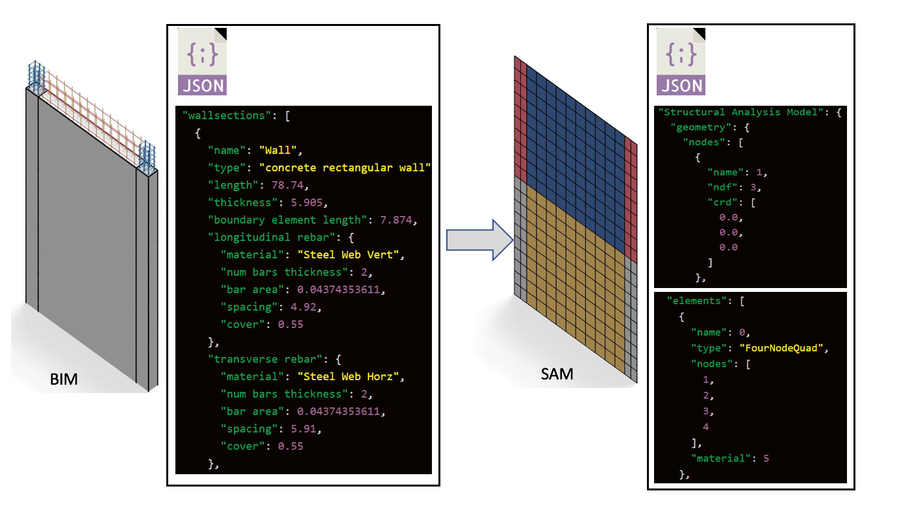

# BIM2SAM.AI
Building Information Models (BIM) to Structural Analysis Models (SAM) Using Artificial Intelligence



### Build instructions
##### 1. Build the SAMBuilder and TclBuilder excutables

```
sh build
```
##### 2. Install Tensorflow if you haven't. 

```
pip install tensorflow
```
###### Or do it in a virtual environment (virtualenv is recommended.) Tensorflow does not work with Python 3.7 or above at the time this code is made, so Python 3.6 is recommended. 

### Training the neural net
```
cd Python/NeuralNets
python BIM2FeaturesNN_V1.py
```
### Use the neural net in a BIM->SAM->tcl pipeline. This will generate a tcl file that can be run in OpenSees:
```
cd Python
python main.py
```

### How to cite
Charles Wang, Caigui Jiang, Stella X. Yu, Frank McKenna, & Kincho H. Law. (2019, October 18). NHERI-SimCenter/BIM2SAM.AI: Release v1.0 (Version 1.0). Zenodo. http://doi.org/10.5281/zenodo.3509957

### Acknowledgement

This material is based upon work supported by the National Science Foundation under Grant No. 1612843.

